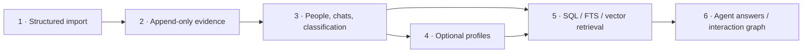

# WeChat Memory

Local, traceable people memory built from user-provided structured chat data.

[中文](README.zh.md) · [Architecture](docs/architecture.md) · [Data contract](docs/data-contract.md) · [Risk boundary](docs/risk-and-data-sources.md)


WeChat Memory turns a structured export into an append-only evidence store, normalized people and conversations, optional AI-generated profiles, hybrid retrieval, and an observed-interaction graph. Every derived claim can point back to a `message_id`.

> [!IMPORTANT]
> This repository starts at the structured-data boundary. It contains no key extraction, decryption, process-memory scanning, reverse engineering, Hook/injection, client modification, or WeChat database-schema parser. It is unofficial and not affiliated with Tencent or WeChat. You are responsible for obtaining and processing data lawfully.

## Six layers



| Layer | Responsibility |
| --- | --- |
| Import | Accept schema-versioned JSON already available to the user |
| Evidence | Preserve source payload versions and hashes |
| Structure | Normalize people, chats, messages, roles, and FTS5 indexes |
| Profiles | Optional, rebuildable summaries and facts with message evidence |
| Query | SQL, FTS5, optional QMD vector search, reciprocal-rank fusion |
| View | Agent answers and a local observed-interaction graph |

Profiles are not required for search. Raw messages remain the source of truth.

## Install

```bash
uv tool install git+https://github.com/interesting-vibe-coding/wechat-memory.git
```

Python 3.11+ with SQLite FTS5 is required.

## Quick start

```bash
wechat-memory import-json examples/demo.json
wechat-memory classify
wechat-memory retrieve "Who is building AI agents?" --mode exact
wechat-memory serve
```

Open `http://127.0.0.1:8765` for the local graph.

Optional semantic search uses [QMD](https://github.com/tobi/qmd):

```bash
npm install -g @tobilu/qmd
wechat-memory index
wechat-memory retrieve "Who is raising a seed round?" --mode hybrid
```

Optional profile generation and standalone answers use the local `codex` CLI:

```bash
wechat-memory profile --person "Alice"
wechat-memory query "Who should I ask about agent infrastructure?"
```

Existing Codex sessions should call `retrieve`, then analyze returned evidence themselves. The included project Skill documents that flow.

## Storage

```text
~/Library/Application Support/wechat-memory/crm.sqlite
~/Library/Application Support/wechat-memory/analysis.sqlite
~/Library/Application Support/wechat-memory/search-docs/
~/Library/Caches/wechat-memory/qmd/wechat-memory.sqlite
```

- `crm.sqlite`: evidence, people, chats, messages, roles, FTS5. Source of truth.
- `analysis.sqlite`: optional profiles, facts, evidence snapshots. Rebuildable.
- search documents and QMD index: rebuildable semantic-retrieval artifacts.

No telemetry. No network server. The graph binds to `127.0.0.1` by default. QMD runs locally. Configuring a cloud model through `codex` may transmit selected message evidence to that provider; review its terms before use.

## Data and legal boundary

Chat exports contain information about other people. User access to a local copy does not automatically establish permission for every later use, upload, inference, or disclosure. Apply purpose limitation, data minimization, retention controls, and applicable consent requirements.

See [risk and data sources](docs/risk-and-data-sources.md). Disclaimers do not remove platform, copyright, privacy, contract, or local-law risk.

## Development

```bash
git clone https://github.com/interesting-vibe-coding/wechat-memory.git
cd wechat-memory
python3 -m venv .venv
.venv/bin/pip install -e .
.venv/bin/python -m unittest discover -s tests -v
```

## License

[MIT](LICENSE). Trademarks and third-party data remain with their respective owners.
