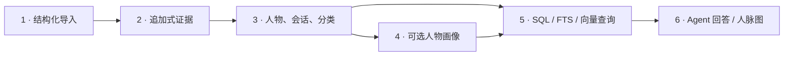

# WeChat Memory

把用户已取得的结构化聊天数据，变成本地、可溯源的人物记忆库。

[English](README.md) · [架构](docs/architecture.md) · [数据契约](docs/data-contract.md) · [风险边界](docs/risk-and-data-sources.md)

> [!IMPORTANT]
> 本仓库从“结构化数据已经存在”开始。仓库不包含取钥、解密、进程内存扫描、逆向工程、Hook/注入、客户端修改或微信数据库 schema 解析。项目与腾讯、微信无关联。用户自行负责数据来源、授权、用途和当地法律合规。

## 六层设计



| 层 | 职责 |
| --- | --- |
| 输入 | 接受符合版本契约、由用户提供的 JSON |
| 证据 | 保存原始 payload 版本和 hash |
| 结构 | 人物、会话、消息、身份分类、FTS5 |
| 画像 | 可选、可删除、可重建；事实保留消息证据 |
| 查询 | SQL、FTS5、可选 QMD vector、RRF 融合 |
| 使用 | 当前 Agent 基于证据回答；本地人脉互动图 |

画像不是查询前置。原消息始终是真相源。

## 安装

```bash
uv tool install git+https://github.com/MisterBrookT/wechat-memory.git
```

需要 Python 3.11+ 和 SQLite FTS5。

## 快速开始

```bash
wechat-memory import-json examples/demo.json
wechat-memory classify
wechat-memory retrieve "谁在做 AI Agent？" --mode exact
wechat-memory serve
```

浏览器打开 `http://127.0.0.1:8765`。

语义检索可选，使用本地 [QMD](https://github.com/tobi/qmd)：

```bash
npm install -g @tobilu/qmd
wechat-memory index
wechat-memory retrieve "谁最近在找投资？" --mode hybrid
```

画像和独立 CLI 回答可选，使用本机 `codex`：

```bash
wechat-memory profile --person "Alice"
wechat-memory query "谁适合聊 Agent 基础设施？"
```

已有 Codex session 默认调用 `retrieve`，由当前 Agent 阅读证据；不要再嵌套一次 Codex。

## 本地存储

```text
~/Library/Application Support/wechat-memory/crm.sqlite
~/Library/Application Support/wechat-memory/analysis.sqlite
~/Library/Application Support/wechat-memory/search-docs/
~/Library/Caches/wechat-memory/qmd/wechat-memory.sqlite
```

- `crm.sqlite`：证据、人物、会话、消息、分类、FTS5；事实层。
- `analysis.sqlite`：画像、事实、证据快照；可重建。
- `search-docs/` 与 QMD index：语义检索派生物；可重建。

项目没有遥测，不启动公网服务；可视化默认只监听 `127.0.0.1`。QMD 本地运行。若给 `codex` 配置云模型，选中的消息证据可能发送给模型服务商，使用前自行审查服务条款。

## 风险边界

聊天数据同时包含对话方、群成员等第三方信息。能读取本地副本，不代表可以任意上传、推断、公开或用于其他目的。应遵循目的限定、最小必要、保存期限、删除与适用的同意要求。

详见[风险与数据来源](docs/risk-and-data-sources.md)。免责声明不能消除平台协议、著作权、个人信息、合同或当地法律风险。

## 开发

```bash
git clone https://github.com/MisterBrookT/wechat-memory.git
cd wechat-memory
python3 -m venv .venv
.venv/bin/pip install -e .
.venv/bin/python -m unittest discover -s tests -v
```

## License

[MIT](LICENSE)。商标、第三方软件和第三方数据权利归各自权利人。
